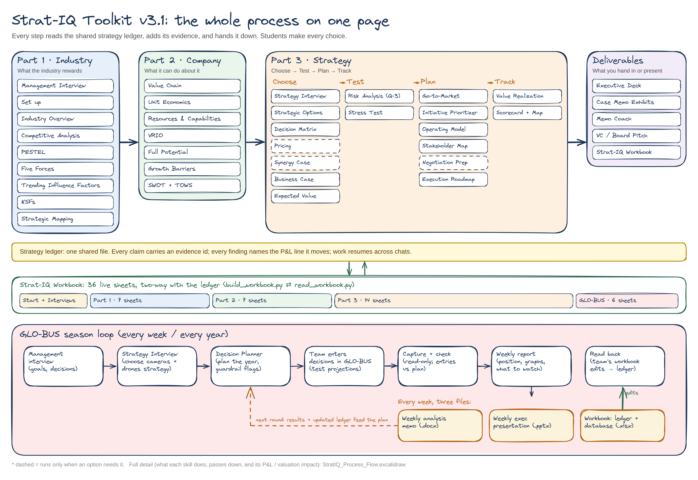
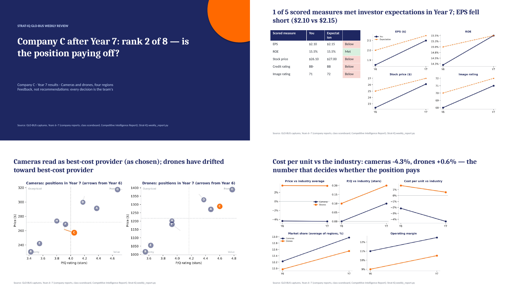
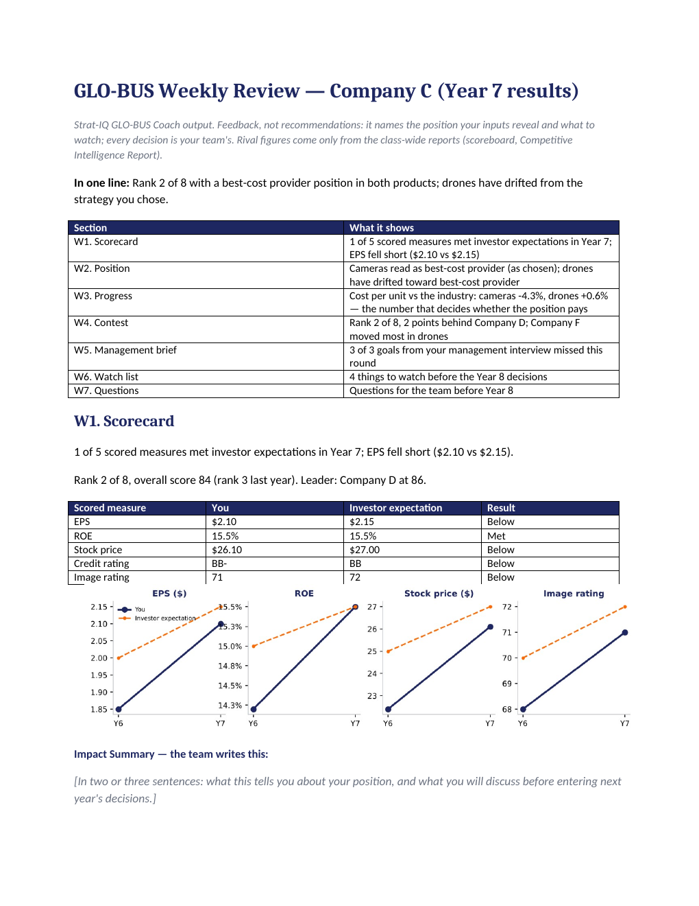

# Strat-IQ Toolkit: AI strategic analysis skills for Claude, with a GLO-BUS weekly coach

**Strat-IQ is a free (noncommercial) Claude skill pack that runs a full strategic analysis the way a
strategy consultant does: industry analysis (PESTEL, Porter's Five Forces, key success factors,
strategic group maps), company analysis (value chain, unit economics, VRIO, SWOT/TOWS), and strategy
(options, decision matrix, NPV business case, Monte Carlo risk analysis, expected value, go-to-market,
Balanced Scorecard).** For the GLO-BUS business simulation it adds a weekly loop that produces three
files every round: an **executive analysis memo**, an **executive PowerPoint presentation**, and an
**Excel workbook that is the team's ledger and database**.

[](LICENSE)


**[Download the latest release](../../releases/latest)** ·
**[Install guide](https://brads777.github.io/Strat-IQ-Strategy-Toolkit/install-guide.html)** ·
**[Project site](https://brads777.github.io/Strat-IQ-Strategy-Toolkit/)** ·
**[Process map](docs/img/StratIQ_Process_Flow.png)**

Built by **Brad Scheller** (Harvard MBA; adjunct professor, Northeastern University) for MGT4850
Strategic Management and for real client work. Formerly *StratOS*.

---

## The whole process on one page



Every step reads one shared **strategy ledger** (a JSON file), adds its evidence, and hands it on, so
the frameworks cannot contradict each other and work resumes across chats. Students make every choice;
Strat-IQ shows the evidence, does the arithmetic and asks the questions.

The detailed map shows, for each of the 44 skills, what it does, what it passes down, how it reaches
the P&L or the valuation, and which workbook sheet it fills:
**[StratIQ_Process_Flow.png](docs/img/StratIQ_Process_Flow.png)** (editable:
[`.excalidraw`](docs/img/StratIQ_Process_Flow.excalidraw), open at excalidraw.com).

| Part | Question it answers | Skills (and the workbook sheets they fill) |
|---|---|---|
| **Start** | What does management need? | Management Interview → *Management Interviews* |
| **Part 1 · Industry** | What does this industry reward? | Industry Overview, Competitive Analysis, PESTEL, Porter's Five Forces, Trending Influence Factors, KSF Scorecard, Strategic Mapping (blue ocean, ERRC) |
| **Part 2 · Company** | What can this company do about it? | Value Chain, Unit Economics (LTV/CAC), Resources and Capabilities, VRIO, Full Potential, Growth Barriers, SWOT + TOWS |
| **Part 3 · Strategy** | Which strategy, is it worth it, and how will we deliver it? | Strategy Interview (positioning), Strategic Options, Decision Matrix, Pricing, Business Case (NPV, IRR), Risk Analysis (tornado, 10,000-run Monte Carlo), Expected Value (EVPI, Bayesian pilot / EVSI), Stress Test, Go-to-Market, Initiative Prioritizer (RICE), Operating Model (RAPID), Stakeholder Map, Execution Roadmap, Balanced Scorecard and Strategy Map |
| **Deliverables** | What do we hand in or present? | Executive Deck, Case Memo Exhibits, Memo Coach, VC / Board Pitch, Strat-IQ Workbook |
| **GLO-BUS** | How are we doing in the simulation, week by week? | GLO-BUS Capture (read-only), GLO-BUS Coach, weekly report → memo, deck, workbook |

## Every week: three files for the team

After each GLO-BUS round the team asks for its weekly report. Strat-IQ reads the team's own results and
the class-wide reports (never another team's screens) and returns:

| File | What is in it |
|---|---|
| **Weekly analysis memo** (`.docx`) | Exhibit-style sections W1-W7: scorecard against investor expectations, the competitive position your inputs actually show versus the strategy you chose, cost and margin trends, the contest with rivals, a check against the goals from your management interview, what to watch next round, and questions. Each section leaves an Impact Summary for the team to write. |
| **Weekly executive presentation** (`.pptx`) | Nine slides with headline titles and charts, ready for the team meeting, with speaker notes that end with the question the instructor is likely to ask. |
| **Strat-IQ Workbook** (`.xlsx`) | 36 live sheets: one per step, plus Season by Year (every decision and result, year over year), Competition by Year, KPI Charts, the Decision Planner and Findings & Questions. |

It is **feedback, not answers**: no decision values and no list of moves. Every decision is the team's,
and the team enters every decision in GLO-BUS itself.

<p align="center">
  
  
</p>

### The workbook is the database (two-way)

The Strat-IQ Workbook is built from the ledger, and **reads back into it**. Change a plan, a score or an
assumption in Excel; `read_workbook.py` lists exactly what changed (sheet, cell, field, was → now) and
writes only those cells back to the ledger. The next weekly report, memo and deck start from the team's
latest numbers. New rows add items; cleared rows remove them; fields the workbook doesn't show are kept.

```bash
python part3/skills/stratiq-workbook/scripts/build_workbook.py --ledger strategy-ledger.json \
    --capture globus-capture-C-Y6.json --capture globus-capture-C-Y7.json --out StratIQ_Workbook.xlsx
python part3/skills/stratiq-workbook/scripts/read_workbook.py StratIQ_Workbook.xlsx --ledger strategy-ledger.json --dry-run
```

In Claude you just say *"build our workbook"* and, after editing it, *"read our workbook back into the
ledger."*

## Why it is different

- **One evidence base, many views.** Competitors' 10-K risk factors and MD&A are mined before PESTEL;
  every PESTEL factor, trend and force names the P&L line it moves; no KSF without a force or trend
  behind it; no map axis chosen freely.
- **Honest about white space.** Blue-ocean candidates ship stamped *capability: UNVALIDATED* until VRIO
  shows the firm can actually serve them.
- **Real decision statistics.** NPV and break-even, a tornado and Monte Carlo on the business case,
  expected value with maximin and the flip point, and Bayes' rule to price a pilot before betting.
- **Students choose.** The Strategy Interview asks one question at a time and never picks; the Memo Coach
  returns questions, never text; GLO-BUS feedback never gives decision values.
- **Nothing is lost.** Every step writes to the ledger; swap the base company and only the company layer
  reruns.

## Install

A full step-by-step guide with links is in **[the install guide](https://brads777.github.io/Strat-IQ-Strategy-Toolkit/install-guide.html)** (source: [docs/install-guide.html](docs/install-guide.html)).
The short version:

### Claude.ai (web — no install; what MGT4850 students use)

1. In **Settings → Capabilities**, turn on **Code execution and file creation** (needed for skills).
   On a university or company plan, an admin may need to enable skills for you.
2. If you installed an earlier version, delete every skill whose name starts with **`stratos-`** (the
   old StratOS names) in **Settings → Capabilities → Skills**.
3. Download **`stratiq-toolkit-skills.zip`** from the **[latest release](../../releases/latest)** and unzip
   it once: inside are 40 zips, one per skill (leave those zipped). Choose **Upload skill** and upload
   all 40. (Only want Part 1? `stratiq-part1-skills.zip` holds the original fourteen.)
   *Instructors:* if your admin provisions the skills org-wide, students skip steps 1–3.
4. Create a **Project** (e.g. "Strat-IQ — EV industry") and add
   [`project-data/industries.json`](project-data/industries.json) to its **Project knowledge**.
5. Open a chat in that Project and type **"Run Strat-IQ."** It starts with the management interview
   and shows the route through Parts 1-3 and the GLO-BUS loop.

### Claude Code (terminal)

```bash
git clone https://github.com/Brads777/Strat-IQ-Strategy-Toolkit.git
cp -r Strat-IQ-Strategy-Toolkit/skills/stratiq-* Strat-IQ-Strategy-Toolkit/part2/skills/stratiq-* Strat-IQ-Strategy-Toolkit/part3/skills/stratiq-* ~/.claude/skills/
cd your-analysis-folder && mkdir -p project-data
cp /path/to/Strat-IQ-Strategy-Toolkit/project-data/industries.json project-data/
claude    # then: "Run Strat-IQ"
```

The KSF scoring script needs Python 3.10+ (`python skills/stratiq-ksf/scripts/score_ksf.py <csv>`).

### Optional: live financial data via OpenBB

Competitive Analysis uses the [OpenBB](https://github.com/OpenBB-finance/OpenBB) MCP server as its
default data source when connected, and falls back to SEC EDGAR and web research when not.
Setup: [`openbb-mcp.md`](skills/stratiq-competitor-intel/references/openbb-mcp.md).

---

## Using it

| Say | What happens |
|---|---|
| *"Run Strat-IQ"* | Resumes from the saved ledger or starts with the management interview, then walks Parts 1-3 with a checkpoint after each step |
| *"Run the PESTEL for the EV industry"* | Runs only that skill (every skill also works on its own) |
| *"Make Xiaomi the base company"* | Keeps Part 1 (the industry) and reruns Part 2 for the new company |
| *"Build my case-memo exhibits"* | Builds the course memo exhibits in template order; every Impact Summary is left for the student |
| *"Weekly report for Company C, Year 7"* (captures attached) | The weekly analysis memo, executive presentation and workbook |
| *"Check our Year 8 entries against the plan"* | Compares what the team entered in GLO-BUS with the Decision Planner and flags differences |
| *"Read our workbook back into the ledger"* | Lists the team's edits in the workbook, then writes them to the ledger |

A complete worked example (BYD in global EVs, GLO-BUS Company C) with nine screen-recordable demos is
in [`demo/`](demo/README.md). Industries, including the GLO-BUS **digital camera and drone** industries,
are in [`project-data/industries.json`](project-data/industries.json); add your own with "Add another
industry" at intake. Ledger schema:
[`ledger-schema.md`](part2/skills/stratiq-orchestrator-final/references/ledger-schema.md).

## What is not included

Strat-IQ's proprietary scoring algorithms (W-B-A-F-D vector scoring, P-E-F decision-criteria
weighting, SFI and SCE) run behind a private Strat-IQ API and are **not** in this repository. Without
the API the skills use transparent public fallbacks and stamp their output `method: "public-screen"`.

**Known gap:** the public fallback screen for assigning the five vector roles in Strategic Mapping is
still being written (marked `TODO(Brad)` in the skill).

## Evidence discipline

The skills never invent market shares, margins, prices, regulation names, dates or statistics.
Figures without a source are marked `[unverified]`; private-company figures are marked `[E]`
(estimate) with low confidence; missing data is shown as a visible caveat, never hidden.
Outputs are analysis aids, not investment advice.

## Credits and licence

© 2026 Brad Scheller. Free for noncommercial use: scripts under [PolyForm Noncommercial 1.0.0](LICENSE-CODE.md), skill text and documents under [CC BY-NC 4.0](LICENSE-CONTENT.txt). Commercial and enterprise use needs a licence: [COMMERCIAL-LICENSE.md](COMMERCIAL-LICENSE.md), BScheller@ToolsIQ.ai. Versions before 3.1.0 were released under Apache 2.0.
The skills synthesise methods from open-source work by Anthropic (`financial-services-plugins`),
DogInfantry (B1 management consultant), Eric Young (`alpha-insights`), Pawel Huryn (`pm-skills`),
ironyjk (`strategy-frameworks`) and Yoichi Ojima (`consultant`). Full provenance and licences:
[`SOURCES.md`](skills/stratiq-orchestrator/references/SOURCES.md) and [`NOTICE`](NOTICE).

Issues and pull requests are welcome.

---

<sub>Keywords: Claude skills, Claude AI strategy, AI strategic analysis, strategic management, business
strategy toolkit, PESTEL analysis, Porter's Five Forces, key success factors, strategic group map, blue
ocean strategy, ERRC grid, value chain analysis, unit economics, VRIO, SWOT, TOWS matrix, decision
matrix, business case NPV, Monte Carlo simulation, tornado chart, expected value, Bayesian decision
analysis, go-to-market, RICE prioritization, RAPID decision rights, Balanced Scorecard, strategy map,
case analysis memo, GLO-BUS simulation, GLO-BUS strategy, business simulation coach, executive memo,
executive presentation, Excel strategy workbook, MBA strategy course.</sub>
