# Strat-IQ Toolkit

**A Claude skill pack that analyses an industry and its competitors the way a strategy consultant
does — from annual reports to blue-ocean whitespace — with every claim traced to evidence.**

[](LICENSE)


Built by **Brad Scheller** for MGT4850 Strategic Management (Northeastern University, Fall 2026) and
for real client work. Formerly StratOS.

---

## What it does

Pick an industry, list the competitors, choose a base company — and Strat-IQ runs one connected
external analysis:

```mermaid
flowchart LR
    A[Intake<br/>industry · competitors<br/>base company] --> IO[Industry Overview<br/>size · segments · history ·<br/>life cycle] --> B[Competitive Analysis<br/>10-Ks · financials · news]
    B --> C[PESTEL Analysis<br/>macro → P&L line]
    C --> D[Porter's Five Forces<br/>scored 1–5 · profit pool]
    D --> E[Trending Influence Factors<br/>3–5 drivers · forces re-scored]
    E --> F[KSFs<br/>industry scorecard +<br/>per-company view]
    F --> G[Strategic Mapping<br/>36 vectors · whitespace ·<br/>blue ocean · ERRC]
    G --> H[Detailed research report<br/>+ saved ledger] --> I[Executive<br/>PowerPoint deck]
```



Most AI strategy prompts produce five disconnected frameworks. Strat-IQ treats them as **one evidence
base rendered five ways**, so they cannot contradict each other:

- **Primary evidence first.** Competitors' 10-K risk factors and MD&A are mined *before* PESTEL —
  management's own disclosure of what threatens the business, made under legal liability.
- **Every finding hits the P&L.** Each PESTEL factor, trend and force names the P&L line it moves
  (price, volume, mix, input costs, opex, capex, financing, levies) and in which direction.
- **Chain rules, enforced.** No force score without evidence; no trend without at least two source
  types; no KSF that does not trace to a force or trend; no map axis chosen freely.
- **KSFs in two tiers.** One industry yardstick scores every competitor comparably — then each firm
  gets a strategy-weighted view and its own critical success factors.
- **Maps that find something.** Instead of price vs. quality (where everyone lines up on a diagonal),
  firms are re-plotted on orthogonal vectors from a 36-vector library to expose empty space.
- **Honest about whitespace.** Blue-ocean candidates ship stamped `capability: UNVALIDATED` — an empty
  space may be a *Mirage Trap* that nobody wants or this firm cannot serve.
- **Nothing is lost between chats.** Every stage writes to one JSON ledger. Swap the base company and
  only the company layer reruns.

## The skills

| Display name | Skill ID | What it produces |
|---|---|---|
| **External Analysis** | [`stratiq-orchestrator`](skills/stratiq-orchestrator/SKILL.md) | Intro screen, guided or question mode, intake, chain checks, ledger, final report |
| **Industry Overview** | [`stratiq-industry-overview`](skills/stratiq-industry-overview/SKILL.md) | Ten-component, business-plan-style introduction: scope, market size, growth, segments, economics, history, players, life-cycle stage, trends, roadmap |
| **Competitive Analysis** | [`stratiq-competitor-intel`](skills/stratiq-competitor-intel/SKILL.md) | Financial benchmark (3 yrs + LTM), 10-K seeds, hiring/patent/news signals, moats |
| **PESTEL Analysis** | [`stratiq-pestel`](skills/stratiq-pestel/SKILL.md) | 15–25 findings with impact, certainty, velocity, P&L line, transmission mechanism |
| **Porter's Five Forces** | [`stratiq-five-forces`](skills/stratiq-five-forces/SKILL.md) | Forces scored 1–5 on evidence, attractiveness, profit-pool close |
| **Trending Influence Factors** | [`stratiq-driving-forces`](skills/stratiq-driving-forces/SKILL.md) | 3–5 drivers from all sources, forces re-scored at the horizon |
| **KSFs** | [`stratiq-ksf`](skills/stratiq-ksf/SKILL.md) | 6–10 KSFs, weighted scorecard ([`score_ksf.py`](skills/stratiq-ksf/scripts/score_ksf.py)), sensitivity, white space |
| **Strategic Mapping** | [`stratiq-strategic-mapping`](skills/stratiq-strategic-mapping/SKILL.md) | Conventional and disruption maps, whitespace, blue-ocean candidates with ERRC |
| **Executive Deck** | [`stratiq-exec-deck`](skills/stratiq-exec-deck/SKILL.md) | 15-slide executive PowerPoint: action titles, one chart per slide, sources, speaker notes |
| **Case Memo Exhibits** | [`stratiq-case-exhibits`](skills/stratiq-case-exhibits/SKILL.md) | Builds the course Case Analysis Memo exhibits C–G and L–O in template order; Impact Summaries left for the student |
| **Decision Criteria** | [`stratiq-decision-criteria`](skills/stratiq-decision-criteria/SKILL.md) | Exhibit L — criteria tied to the goals in the student's Exhibit B, weighted 1–5 |
| **Decision Matrix** | [`stratiq-decision-matrix`](skills/stratiq-decision-matrix/SKILL.md) | Exhibits N and M — pros/cons, then weighted scoring ([`decision_matrix.py`](skills/stratiq-decision-matrix/scripts/decision_matrix.py)) with ties and sensitivity |
| **Segment Value** | [`stratiq-segment-value`](skills/stratiq-segment-value/SKILL.md) | Exhibit O — segment CLV × customers ([`segment_value.py`](skills/stratiq-segment-value/scripts/segment_value.py)) |
| **GLO-BUS Coach** | [`stratiq-globus-coach`](skills/stratiq-globus-coach/SKILL.md) | Decision support for the GLO-BUS simulation: strategy anchor, diagnosis against the five KPIs (EPS, ROE, stock price, credit rating, image rating), 3–5 testable moves with guardrails |

Each stage skill also works on its own — ask for "a PESTEL of the EV industry" and only that skill runs.

### Parts 2 and 3 — the company, and making the strategy work (v3.0.0)

Part 1, above, reads the industry. **[Part 2](part2/README.md)** reads the company: Value Chain, Unit
Economics, Resources and Capabilities, VRIO, Full Potential, Growth Barriers and SWOT (Case Memo
Exhibits H-K, with J-1, K-1 and K-2). **[Part 3](part3/README.md)** makes the strategy work: options,
business case, expected value, a stress test, go-to-market, the plan, KPIs and the pitch (optional
Exhibits P-T). The release also adds the **GLO-BUS camera and drone industries** to
[`industries.json`](project-data/industries.json) and a **CIR gap analysis** to the GLO-BUS Coach.

Both parts install together as one upload, `stratiq-part2-3-skills.zip` in the
[latest release](../../releases/latest), on top of Part 1. Instructions:
**[the Parts 2 + 3 guide](https://brads777.github.io/stratos-external-analysis/part2-3-guide.html)**.

---

## Install

A full step-by-step guide with links is in **[the install guide](https://brads777.github.io/stratos-external-analysis/install-guide.html)** (source: [docs/install-guide.html](docs/install-guide.html)).
The short version:

### Claude.ai (web — no install; what MGT4850 students use)

1. In **Settings → Capabilities**, turn on **Code execution and file creation** (needed for skills).
   On a university or company plan, an admin may need to enable skills for you.
2. If you installed an earlier version, delete every skill whose name starts with **`stratos-`** (the
   old StratOS names) in **Settings → Capabilities → Skills**.
3. Download **`stratiq-toolkit-skills.zip`** from the **[latest release](../../releases/latest)** and unzip
   it once: inside are 40 zips, one per skill (leave those zipped). Choose **Upload skill** and upload
   all 40. (Only want Part 1? `stratiq-part1-skills.zip` holds the original fourteen.)
   *Instructors:* if your admin provisions the skills org-wide, students skip steps 1–3.
4. Create a **Project** (e.g. "Strat-IQ — EV industry") and add
   [`project-data/industries.json`](project-data/industries.json) to its **Project knowledge**.
5. Open a chat in that Project and type **"Run Strat-IQ External Analysis."**

### Claude Code (terminal)

```bash
git clone https://github.com/Brads777/stratos-external-analysis.git
cp -r stratos-external-analysis/skills/stratiq-* stratos-external-analysis/part2/skills/stratiq-* stratos-external-analysis/part3/skills/stratiq-* ~/.claude/skills/
cd your-analysis-folder && mkdir -p project-data
cp /path/to/stratos-external-analysis/project-data/industries.json project-data/
claude    # then: "Run Strat-IQ External Analysis"
```

The KSF scoring script needs Python 3.10+ (`python skills/stratiq-ksf/scripts/score_ksf.py <csv>`).

### Optional: live financial data via OpenBB

Competitive Analysis uses the [OpenBB](https://github.com/OpenBB-finance/OpenBB) MCP server as its
default data source when connected, and falls back to SEC EDGAR and web research when not.
Setup: [`openbb-mcp.md`](skills/stratiq-competitor-intel/references/openbb-mcp.md).

---

## Using it

When the orchestrator opens it shows an intro screen and asks how you want to work:

| Mode | What happens |
|---|---|
| **A. Walk me through it** | All eight steps in order, with a checkpoint after each (continue / revise / stop), ending in a full report: executive summary, an **industry overview** (recent history, market size, level of competition, growth and projections, trends), attractiveness verdict, KSF scorecard, strategic maps, recommended moves, watch list — delivered as a detailed, cited Word report plus a 15-slide executive PowerPoint. |
| **B. Ask a specific question** | Runs only the steps your question depends on, says which it ran, and answers. |
| **C. Build my case-memo exhibits** | For the course Case Analysis Memo: enter the case facts you gathered (company, industry, competitors, interview notes) and your Exhibits A–B; it builds Exhibits C–G and L–O. You write the memo and every Impact Summary. |
| **Resume** | Attach a saved `strategy-ledger-*.json` and continue where you stopped. |

Example prompts:

- *"Run Strat-IQ External Analysis on the EV industry with BYD as the base company."*
- *"What are the key success factors for EVs, and who is strongest?"*
- *"How does Stellantis compare financially with BYD and Xiaomi?"*
- *"Where is the whitespace in this industry?"*
- *"Now make Xiaomi the base company."* — keeps the industry analysis, reruns only the company view.

### Adding your own industry

Choose **"Add another industry"** at intake, or add an entry to
[`project-data/industries.json`](project-data/industries.json):

```json
{ "id": "dental-dso", "name": "Dental service organisations", "boundary": "…",
  "geography": "US", "horizon": "2026-2029", "scenario": "Enterprise", "locked": false,
  "competitors": [ { "name": "…", "ownership": "private", "ticker": null } ] }
```

Entries with `"locked": true` keep a fixed class competitor list that students cannot edit.

### Where your work is saved

Every stage writes to a single ledger (schema: [`ledger-schema.md`](skills/stratiq-orchestrator/references/ledger-schema.md)).
In Claude.ai, download it at each checkpoint and add it to the Project's knowledge; in Claude Code it
lives at `.strategy/ledgers/<scope>.json`.

---

## What is not included

Strat-IQ's proprietary scoring algorithms (W-B-A-F-D vector scoring, P-E-F decision-criteria
weighting, SFI and SCE) run behind a private Strat-IQ API and are **not** in this repository. Without
the API the skills use transparent public fallbacks and stamp their output `method: "public-screen"`.

**Known gap:** the public fallback screen for assigning the five vector roles in Strategic Mapping is
still being written (marked `TODO(Brad)` in the skill).

## Evidence discipline

The skills never invent market shares, margins, prices, regulation names, dates or statistics.
Figures without a source are marked `[unverified]`; private-company figures are marked `[E]`
(estimate) with low confidence; missing data is shown as a visible caveat, never hidden.
Outputs are analysis aids, not investment advice.

## Credits and licence

© 2026 Brad Scheller. Free for noncommercial use: scripts under [PolyForm Noncommercial 1.0.0](LICENSE-CODE.md), skill text and documents under [CC BY-NC 4.0](LICENSE-CONTENT.txt). Commercial and enterprise use needs a licence: [COMMERCIAL-LICENSE.md](COMMERCIAL-LICENSE.md), BScheller@ToolsIQ.ai. Versions before 3.1.0 were released under Apache 2.0.
The skills synthesise methods from open-source work by Anthropic (`financial-services-plugins`),
DogInfantry (B1 management consultant), Eric Young (`alpha-insights`), Pawel Huryn (`pm-skills`),
ironyjk (`strategy-frameworks`) and Yoichi Ojima (`consultant`). Full provenance and licences:
[`SOURCES.md`](skills/stratiq-orchestrator/references/SOURCES.md) and [`NOTICE`](NOTICE).

Issues and pull requests are welcome.
